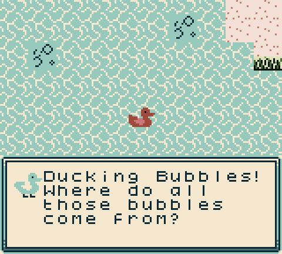

# BubbleQuack

Stop the elephant from bubbling up your pond, find your ducklings that flew from all the bubbles and bring them back to safety.

This game was made for the [Global Game Jam 2025](https://globalgamejam.org/games/2025/bubblequack-9) in 48 hours.

Thanks to [TradeByte](https://www.tradebyte.com) for providing the jam site.

## Play
### Web
▶ Play it online on [https://bubblequack.com](https://bubblequack.com)

### Downloads
* [GameBoy Color ROM](https://bubblequack.com/bubblequack.gbc)
* [Analogue Pocket ROM](https://bubblequack.com/bubblequack.pocket)

You can play the game on a real GameBoy console or using an emulator on a wide variety of devices:

## License

## Credits
see [CREDITS.md](CREDITS.md)
